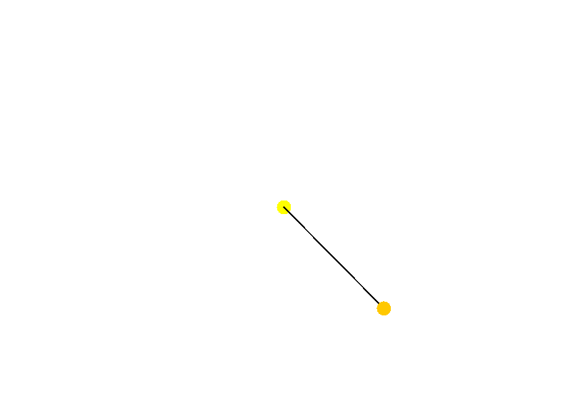

# Pendulum Simulator

## Descripción del Proyecto

El **Pendulum Simulator** es una aplicación Java que simula el movimiento de un péndulo simple utilizando el método de Runge-Kutta para la integración numérica. La aplicación muestra una animación gráfica del péndulo y grafica los datos de la simulación, como el ángulo y la velocidad angular, a lo largo del tiempo.

## Clases del Proyecto

### `Main`
- **Descripción**: Configura y ejecuta el simulador de péndulo.
- **Responsabilidad**: Inicializa el péndulo, el simulador, la vista y el presentador, y configura la ventana de la aplicación.

### `Pendulum`
- **Descripción**: Representa el estado del péndulo.
- **Responsabilidad**: Almacena los parámetros del péndulo, como la longitud, la fricción, la gravedad, el ángulo y la velocidad angular.

### `PendulumData`
- **Descripción**: Almacena los datos del péndulo.
- **Responsabilidad**: Guarda el tiempo, el ángulo y la velocidad angular para fines de análisis y graficación.

### `PendulumSimulator`
- **Descripción**: Simula el comportamiento del péndulo.
- **Responsabilidad**: Utiliza el método de Runge-Kutta para calcular la nueva posición y velocidad del péndulo en cada paso de tiempo.

### `PendulumPhysics`
- **Descripción**: Maneja los cálculos físicos del péndulo.
- **Responsabilidad**: Proporciona métodos para calcular la aceleración y la integración numérica mediante Runge-Kutta.

### `PendulumPanel`
- **Descripción**: Muestra la animación del péndulo.
- **Responsabilidad**: Dibuja el péndulo en la pantalla utilizando Java Swing y actualiza su posición en cada paso de tiempo.

### `PendulumPresenter`
- **Descripción**: Maneja la lógica de presentación.
- **Responsabilidad**: Actúa como intermediario entre la vista y el modelo, actualizando la animación del péndulo.

### `PendulumGraph`
- **Descripción**: Grafica los datos del péndulo.
- **Responsabilidad**: Utiliza JFreeChart para crear gráficos del ángulo y la velocidad angular del péndulo a lo largo del tiempo.

## Conclusión

El **Pendulum Simulator** es una herramienta educativa que proporciona una representación visual y gráfica del comportamiento de un péndulo simple. La aplicación está diseñada siguiendo el principio de responsabilidad única, lo que facilita su mantenimiento y ampliación. Gracias a su estructura modular y clara, es fácil de entender y modificar, permitiendo a los desarrolladores agregar nuevas funcionalidades o mejorar las existentes con facilidad.
